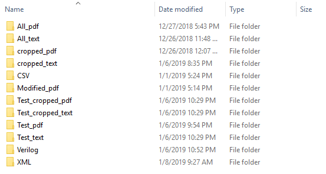

# FASoC Datasheet-Scrubber

The FASoC Datasheet Scrubber is a utility that scrubs through large sets of PDF datasheets/documents in order to extract key circuit information. The information gathered is used to build a database of commercial off-the-shelf (COTS) IP that can be used to build larger SoC in the FASoC design. More information [here](https://fasoc.engin.umich.edu/datasheet-scrubber)

You can do Datasheet Scrubbing by running `Datasheet_Scrubbing.py`, which you can input a datasheet (between one of ADC, CDC, DCDC, PLL, LDO, SRAM, Temperature Sensor, BDRT, Counters, DAC, Delay_Line, Digital Potentiometers, DSP, IO, Opamp categories) and observe the extracted specs and pins. Instruction steps of each of these would be as follows:

### Environment

Python 3.7 is required, older versions of Python will not work. You will also need the following Python libraries which can be installed via pip (in PowerShell/terminal).

1. Install and upgrade pip: `python -m pip install --upgrade pip`

2. Install Python dependencies
	```
	pip install pandas
	pip install -U scipy
	pip install matplot
	pip install matplotlib
	pip install pdfminer.six
	pip install pypdf2
	pip install request
	pip install lxml
	pip install tabula-py
	pip install sklearn
	pip install regex
	pip install keras
	pip install tensorflow
	pip install pdf2image
	pip install pillow
	pip install pytesseract
	pip install -U numpy
	pip install opencv-python
	```

Here we propose two different approaches:
- Categorization using Bag of words, text extraction using regular expression, and table extraction using tabula (please see [here](https://github.com/chezou/tabula-py) for more information)
- Categorization, text extraction, and table extraction using Convolutional neural network (CNN) (please see [here](https://en.wikipedia.org/wiki/Convolutional_neural_network) for more information)
   - If you want to test the CNN part, we need more software:
     - Poppler
     - Tesseract
     - Visual Studio 2017

### Getting Started

These are steps for compiling codes:
1. Clone the [datasheet-scrubber repository](https://github.com/idea-fasoc/datasheet-scrubber)
	```bash
	git clone https://github.com/idea-fasoc/datasheet-scrubber.git
	```

2. Go to [here](https://www.dropbox.com/s/ad4nolrpxx4pks6/All_pdf.zip?dl=0) and download (All_pdf.zip should be downloaded)

3. Run make init which runs Initializer.py. It will ask you to type All_pdf.zip directory, your work directory, and your code dirrectory (for datasheet scrubbing) that you have just cloned. After running initializer.py you should see something like this.



4. All_pdf, All_text, cropped_pdf, and cropped_text are training directories. For addign more files to training set put your labeled pdf files in All_pdf directory (it means put ADC datasheets in ADC folder inside All_pdf, CDC datasheet in CDC folder inside All_pdf and so on).

5. Run make categorizer which runs test_confusion_matrix.py and shows the confusion matrix of our categorizer on whole dataset.

6. Put pdf files of datasheets that you want to test in Test_pdf folder and please email them to fayazi@umich.edu in order to have a better repository.

7. Run make extraction which runs Datasheet_Scrubbing.py which you can input a datasheet (between one of ADC, BDRT, CDC, counters, DAC, DCDC, Delay_Line, Digital_Potentiometers, DSP, IO, LDO, Opamp, PLL, SRAM, Temperature Sensor categories) and observe the extracted specs and pins. 

### Contributing

Extracted datasheets can be emailed to fayazi@umich.edu in order build a bigger repository.
